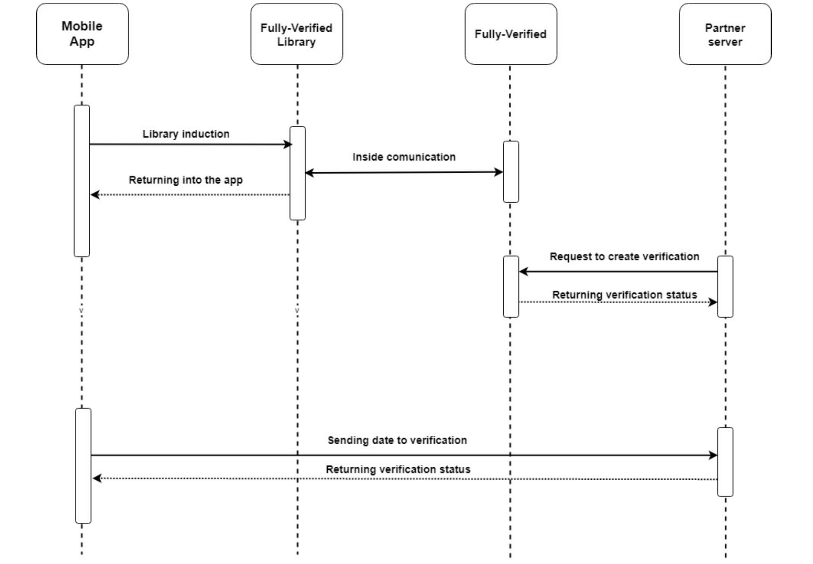

# Fully Verified library documentation - Android

## About Fully-Verified

Fully-Verified is a banking-grade identity verification service, which uses real human verification specialists, 
and verifies people, and their documents, live, on video. All in under 7 minutes.

## Introduction
Fully-Verified developers team created mobile libraries that allows you to run verification process without need to 
leave your app. It is comfortable for your users and it make them feel even more safe. Fully-Verified verification 
can now be integrated part of creating bank account, getting a loan, shopping online process.

Fully-Verified libraries are native libraries for Android and iOS platform.

## Requirements
Our libraries work with Android 5.0 and higher or iOS 12.0 and higher. Before you start working with libraries please 
check if your integration with Fully-Verified API works properly. If you are not integrated check our API Integration 
documentation and follow described steps. API integration is necessary for correct working of libraries.

Verification hash - 128 character hash - you will receive it as part of URL after /customer/api/verify/ call and also 
in e-mail

## Verification Flow
Library starts working with verification waiting screen and this is the first step of verification process. User do not 
need to log in to the verification or filling up any extra fields. In next step user will be connected with operator 
that will run the verification. Once verification is done the library stops working. Next screen that user will see 
depends on verification status and your app action that is connected with the status, e.g. when verification has status 
succeed user will get the pass to the next step of creating account.

Libraries communication scheme:


## Project configuration

The first step is to set the value at least to `minSdkVersion=21` in file `build.gradle`

### Adding dependencies

Create `libs` folder in project root directory.

Unzip fullyverifiedsdk-1.49.1.zip in the already created `libs` folder.

Next in project `build.gradle` file in section allprojects -> repositories add local maven repository.
```gradle
maven { url file("${rootProject.projectDir}/libs") }
```

Whole section should be similar to this:
```
allprojects {
    repositories {
        google()
        jcenter()
        maven { url file("${rootProject.projectDir}/libs") }
    }
}
```

The next step is adding a dependency to application module:

```gradle
    implementation "com.fully_verified:fullyverifiedsdk:1.49.1"
```


### Definition of AndroidManifest file

Add the following to `AndroidManifest.xml` file:

```xml
    <uses-permission android:name="android.permission.CAMERA" />
    <uses-permission android:name="android.permission.FLASHLIGHT" />
    <uses-permission android:name="android.permission.INTERNET" />
    <uses-permission android:name="android.permission.RECORD_AUDIO" />
    <uses-permission android:name="android.permission.MODIFY_AUDIO_SETTINGS" />
    <uses-permission android:name="android.permission.ACCESS_NETWORK_STATE" />
    <uses-permission android:name="android.permission.ACCESS_WIFI_STATE" />
```

Next, in `application` section, add `TransferActivity`:

```xml
        <activity
            android:name="com.fully_verified.fullyverifiedsdk.activities.FullyVerified"
            android:configChanges="orientation"
            android:screenOrientation="sensorPortrait"/>

        <activity
            android:name="com.fully_verified.fullyverifiedsdk.opsless.view.FullyVerified"
            android:configChanges="orientation"
            android:screenOrientation="sensorPortrait"/>
```

### Implementation
Now you need to start Fully-Verified library, so your class has to implement FullyVerifiedListener with methods below

```java
@Override
public void onConnected(String verificationId) {
    Log.d(TAG, "Listener onConnected");
}
@Override
public void onDisconnect(String verificationId) {
    Log.d(TAG, "Listener onDiconnected");
}
@Override
public void onVerificationStateChange(String verificationId, FullyVerifiedState state) {
    Log.d(TAG, "Listener onVerificationStateChange: " + state);
}
```
Following states will be returned to you class CONNECTING, CONNECTED, WAITING, INPROGRESS, FINISHED, DISCONNECTED.

After that you only need to call Fully-Verified library with a hash which you received from our Verification Create 
WebService. For further information about Verification Create WebService please read API integration documentation HERE.

```java
import com.fully_verified.fullyverifiedsdk.FullyVerified;
import com.fully_verified.fullyverifiedsdk.FullyVerifiedEnvironment;

...
    
    // variant 1 - start verification that handles all errors by SDK
    FullyVerified fullyVerified = FullyVerified.startVerification(verificationHash, YourActivity.this, this);

    // variant 2 - start verification that throws exception when error
    try {
        FullyVerified fullyVerified = FullyVerified.startVerification(verificationHash, YourActivity.this, this, false);
    } catch (FullyVerifiedException e) {
        e.printStackTrace();
    }
```

Set correct environment
```java
FullyVerified.setEnvironment(FullyVerifiedEnvironment.LIVE); // FullyVerifiedEnvironment.LIVE - is set by default, don't need to set it explicit
or
FullyVerified.setEnvironment(FullyVerifiedEnvironment.STAGING);
```
Register notification token in our backend, we need this information to send, notification to your backend about queue 
position change and so on, because we are not able to send notification directly to your app.
```java
    FullyVerified.registerNotificationToken(YourActivity.this, token);
```